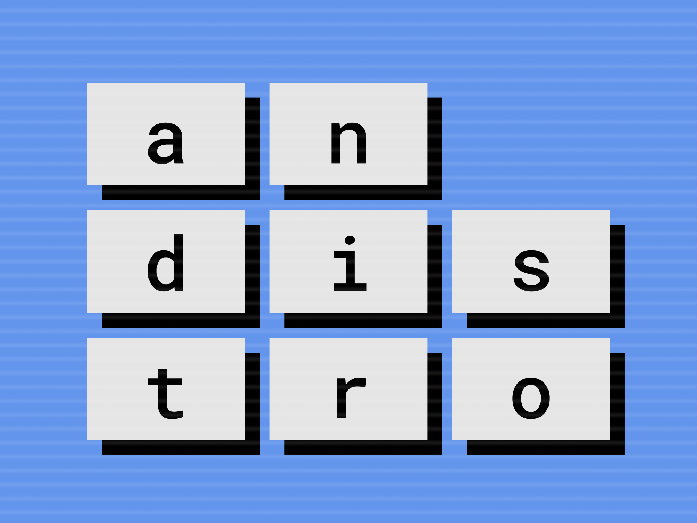
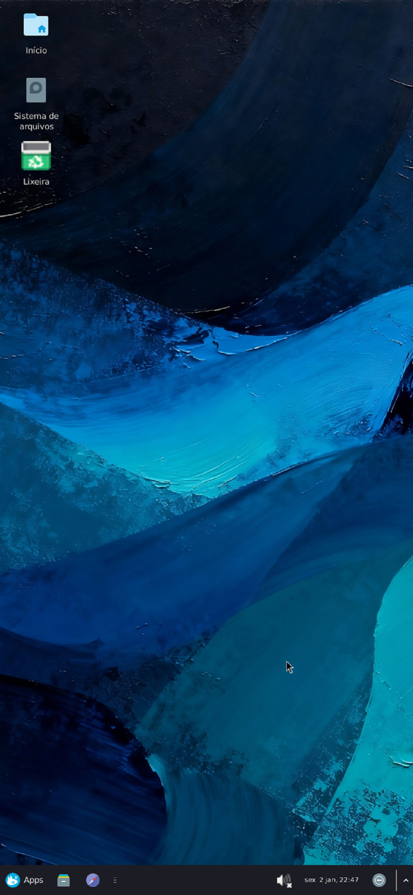
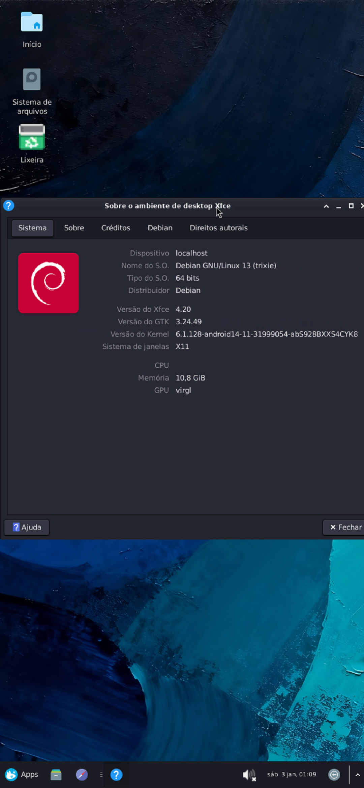
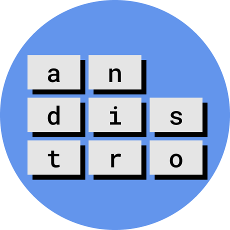
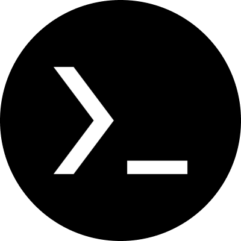
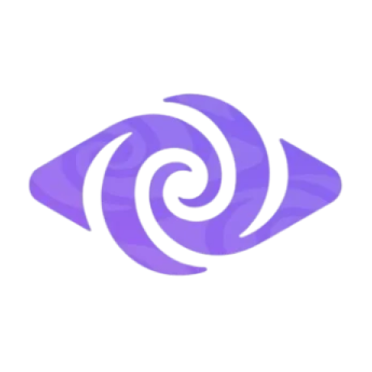
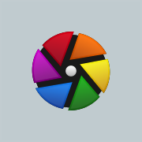
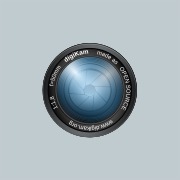
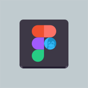
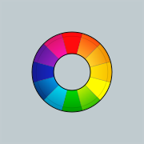

<!--
<div align="center">
<a href="#"></a>
</div>
-->
<div id="portugues" lang="pt-br">


<br>
<a href="https://www.linkedin.com/company/andistro/" target="about:blank"></a>


#


   

#
[](#english)

<br><br>

## Imagens


|||
|-|-|

<br><br>

||[Guia de instalação e resolução de problemas](https://github.com/andistro/wiki/tree/main/pt-BR#readme)|
|-|-|
<!--||[**Installation and troubleshooting guide**](https://github.com/andistro/wiki/tree/main/en-US#readme)| -->

<br><br>

## Info
As informações podem ser alteradas caso alguém informe melhorias.

||||
|-|-|-|
||Arquitetura|ARM |
||Espaço livre no armazenamento| O AnDistro usará pelo menos 2GB do armazenamento interno do aparelho |
||Memória RAM|Acima de 4GB, mas é recomendável que seja no mínimo 6GB|
||Versão do Android| 7 ou superior|
||Root|Não é necessário|
||ADB|Necessário a partir do Android 12|
| |Sistema operacional que será instalado | Debian |
||Interface gráfica| XFCE4 e LXDE|

<br>
<br>
<span>⚠️ Usar o sistema em um dispositivo mais fraco pode causar sobrecarga e danificar componentes internos devido a alta demanta de processamento.</span>

<br><br>

## Comandos

|Opções|Descrição|
|-|-|
|**Exclusivas Termux**|Opções para serem usadas exclusivamente no Termux.|
|`andistro`|inicia o menu gráfico do AnDistro no modo dialógo.|
|`andistro terminal`|inicia com a visualização padrão do terminal.|
|`andistro -u`|atualiza o AnDistro e os pacotes necessários para a ultima versão disponível.|
|`andistro -i`|inicia as configurações de instalação do Debian.|
|`andistro -d`|desinstala o Debian.|
|`andistro -d andistro`|desinstala o AnDistro.|
|`andistro --setup storage-permission`|verifica e permite o acesso ao armazenamento do aparelho.|
|`andistro --setup battery`|abre as configurações do aparelho para remover a restrição da bateria.|
|`andistro --setup enable-dev-mode`|abre as configurações para habilitar o modo desenvolvedor.|
|`andistro --setup open-dev-mode`|abre as configurações do modo desenvolvedor.|
|`andistro --setup install-avnc`|abre o link para baixar o AVNC.|
|`andistro --setup autoboot`|habilita a opção para que haja uma pergunta se deseja iniciar o AnDistro toda vez que abrir o Termux|
|`andistro --setup autoboot-disable`|desaabilita a opção para que haja uma pergunta se deseja iniciar o AnDistro toda vez que abrir o Termux.|
|`andistro --setup adb-pair`|parea o termux ao ADB pela depuração por Wi-Fi.|
|`andistro --setup adb-connect`|conecta o Termux ao ADB pela depuração por Wi-Fi.|
|`andistro --setup disable-ghost-process-monitor`|desabilita o monitor de processos fantasma. O causador do `[Process completed (signal 9) ‐ press Enter]`.|
|||
|**Exclusivas Debian**|Opções para serem usadas exclusivamente no Debian.|
|`andistro`|inicia com a visualização padrão do terminal.|
|`andistro --boot vnc`|inicia o servidor VNC nas definições padrão do sistema.|
|**Opções do `andistro --boot vnc`**|Opções para serem usadas após o `andistro --boot vnc` <opções>.|
|`--display` "LARGURAxALTURA"|opicional. Caso use, irá definir a resolução de exibição do sistema no VNC. Pode ser usada antes ou depois do `--port`.|
|`--port` "NÚMERO"|opicional. Caso use, irá definir a porta do servidor VNC. O padrão é 1. Pode ser usada antes ou depois do `--display`.|
|`--kill`|encerra o servidor VNC por completo.|
|`--passwd`|define a senha do servidor VNC.|
|`--dialog-display`|abre um menu em dialog para definir a resolução e porta ou usar resoluções pré-definidas.|

<br><br>

## Por que usar o AnDistro
O AnDistro é uma ferramenta desenvolvida para facilitar a instalação e configuração do Debian diretamente no Termux, de forma prática, intuitiva e automatizada. Diferente de outras alternativas, ele não oferece apenas o sistema puro, mas também realiza etapas de configuração que, em outras ferramentas, precisam ser feitas manualmente.

Enquanto o Termux Proot-Distro instala apenas a imagem básica do Debian, o AnDistro baixa a versão estável mais recente diretamente do site oficial do Debian ([https://deb.debian.org/debian](https://deb.debian.org/debian)) usando a ferramenta `debootstrap`, garantindo autenticidade e segurança. Além disso, aproveita os recursos disponíveis no Termux para automatizar o processo de configuração, economizando tempo e evitando etapas repetitivas.

Uma das principais vantagens do AnDistro é a autoconfiguração inteligente. Durante a instalação, a ferramenta detecta automaticamente o idioma e o fuso horário definidos no sistema Android, aplicando essas configurações ao Debian. Isso elimina a necessidade de ajustes manuais e torna a experiência mais fluida, especialmente para usuários iniciantes. Também foram feitas otimizações visuais e de interface nas áreas do XFCE e do LXDE para tornar o ambiente mais amigável para quem está começando a explorar o Linux.

Outro diferencial importante está na interface de configuração. O AnDistro utiliza o dialog durante a instalação, permitindo que o usuário configure opções como o teclado de forma interativa e simples, algo que outras alternativas costumam ignorar.

O projeto não foi criado para competir com outras soluções existentes, mas sim para resolver problemas recorrentes observados em fóruns e comunidades, como dificuldades na troca de idioma, detecção de fuso horário, ou configuração de aplicativos como o Firefox. Ele busca oferecer uma experiência mais ajustada às necessidades reais dos usuários.

Vale destacar que o AnDistro não é um sistema operacional, mas sim um instalador e configurador automatizado do Debian no Termux. A sua criação foi feita com estudos envolvendo UX Design e o uso de ferramentas de inteligência artificial, como Perplexity, ChatGPT e Claude, para otimizar o código, facilitar pesquisas e tornar o processo de instalação ainda mais eficiente.

Desde o início, o projeto foi idealizado para suportar múltiplas distribuições Linux, mas após um período de desenvolvimento, decidiu-se focar exclusivamente no Debian. No entanto, pode ser que, futuramente, possa receber suporte a outras distribuições, caso isso se mostre viável.

Ao iniciar o Debian com o AnDistro, o usuário tem acesso a um menu inicial que permite definir resoluções de tela ou ajustá-las manualmente. Embora ainda não haja detecção automática devido a limitações do Termux, o sistema oferece opções práticas e claras para diferentes dispositivos.

Por ser um projeto de código aberto, qualquer desenvolvedor pode contribuir, modificar ou até criar sua própria versão do instalador no futuro. O foco principal do AnDistro continuará sendo o de simplificar a instalação e configuração do Debian no Termux, tornando essa experiência acessível tanto para iniciantes quanto para usuários avançados.


<br><br>

## Comparativo

||<br>AnDistro|<br>Andronix|<br>Termux Proot-Distro|<br>Udroid|<br>UserLand|<br>Xodos|
|-|-|-|-|-|-|-|
|Idioma da ferramenta|🇧🇷 Português,<br>🇺🇸 Inglês¹| 🇺🇸 Inglês | 🇺🇸 Inglês | 🇺🇸 Inglês | 🇺🇸 Inglês | 🇺🇸 Inglês |
|Código aberto|✅ Sim|✅ Sim|✅Sim|✅ Sim |✅ Sim|❌ Não|
|Preço|✅ Gratuito|⚠️ Freemium|✅ Gratuito|✅ Gratuito|⚠️ Freemium|✅ Gratuito
|Requer root|✅ Não|✅ Não|✅ Não|✅ Não|✅ Não|✅ Não|
|Depende de aplicativos <br>terceiros|⚠️ Sim|⚠️ Sim|✅ Não. Usa uma extensão própria|⚠️ Sim|✅ Não|✅ Não|
|Idioma da <br>distribuição instalada| ✅ Identifica o idioma do sistema Android | 🇺🇸 Inglês | 🇺🇸 Inglês | 🇺🇸 Inglês | 🇺🇸 Inglês | 🇺🇸 Inglês |
|Ofereçe ferramentas ú||
|Aplicativos de terceiros necessários| Termux, Termux:API, <br>AVNC² ou qualquer outro visualizador VNC| Termux, VNC |Termux, Termux-X11| Termux, VNC | Aplicatívo próprio |Aplicatívo próprio |
|Distros suportadas|Debian|Alpine Linux, Arch Linux, Debian, Fedora, Manjaro, Kali Linux, Ubuntu, Void|Adelie Linux, AlmaLinux, Alpine Linux, Arch Linux, Artix Linux, Chimera Linux, Debian, Deepin, Fedora, Manjaro, OpenSuse, Oracle Linux, Pardus, Rocky Linux, Trisquel, Ubuntu, Void Linux, Guix, NixOS |Ubuntu|Alpine, Arch,<br>Debian, Kali Linux, Ubuntu|
|Suporte a GUI/Desktop|XFCE, LXDE|XFCE, LXDE, LXQT||XFCE4, Gnome| XFCE, LXDE
|Arquiteturas suportadas|ARM| ARM| ARM, x86_64 | ARM |
|Processo de instalação da distribuição Linux| Interface gráfica com dialogos intuitivos ou padrão de termonal linux | Padrão de terminal linux | Padrão de terminal linux | Padrão de terminal linux | Instalação com interface gráfica ou padrão de terminal linux |


<blockquote>
¹ A ferramenta tem a pretenção de suportar mais idiomas.

² O AVNC é um aplicativo opcional. Pode usar qualqer outro que suporte visualização VNC.
</blockquote>


<br><br>


## Como Instalar o AnDistro no Termux
Copie o comando abaixo e cole no Termux. Após teclar enter, o processo de instalação do AnDistro será feito. Este comando permite que semrpe instale a ultima versão instável do AnDistro.


```bash
curl -L "https://bit.ly/andistro" | bash
```


<br><br>

## Softwares*

  ### Navegadores <br><i>(Browsers)</i>

|||||
|-|-|-|-|
|<div align="center">Brave Browser</div>| <div align="center">Chromium</div> | <div align="center">Firefox</div> | <div align="center">Vivaldi</div> |

  #
  
### Gráficos & fotografia <br><i>(Graphics & photography)</i>

|||||
|-|-|-|-|
|<div align="center">Darktable</div> | <div align="center">DigiKam</div> | <div align="center">Figma Linux</div> | <div align="center">Gimp</div> |

|||||
|-|-|-|-|
| <div align="center">Inkscape</div> | <div align="center">Penpot</div> | <div align="center">Photopea</div> | <div align="center">RawTherapee</div> |

||
|-|
| <div align="center">Scribus</div> |

  #

 ### Produtividade <br><i>(Productivity)</i>

||
|-|
| <div align="center">Libre Office</div> |

<!--  
  | <a href="#"></a> | <a href="#"></a> | <a href="#"></a> | <a href="#"></a> |
  |-|-|-|-|
  | <div align="center"></div> | <div align="center"></div> | <div align="center"></div> | <div align="center"></div> |

<br><br><br>

<blockquote align="left">
  <p>* Alguns aplicativos podem não funcionar corretamente, com problemas de tamanho de tela ou de execução de tarefas.</p>
  <p>* Ainda está sendo feita uma análise de quais programas podem ser usados na ferramenta. Caso conheça ou use algum programa que tenha certeza que funciona, poderá solicitar <a href="https://github.com/andistro/app/issues">clicando aqui</a>.</p>
</blockquote>
</div>
<br>
-->
<div align="center">
  
</div>

<blockquote align="left">
  <p><strong>Atenção</strong></p>
  <p>Android é uma marca registrada da Google LLC.</p>
  <p>Linux é a marca registada da Linus Torvalds nos EUA e outros países.</p>
</blockquote>
</div>


<br><br><br><br><br><br><br><br><br><br><br><br><br><br><br><br><br><br><br><br>
<div id="english" lang="en-us">


<br>
<a href="https://www.linkedin.com/company/andistro/" target="about:blank"></a>


#


   

#
[](#portugues)


<br><br>

## Images


|||
|-|-|

<br><br>

<!--||[Guia de instalação e resolução de problemas](https://github.com/andistro/wiki/tree/main/pt-BR#readme)|
|-|-|
||[**Installation and troubleshooting guide**](https://github.com/andistro/wiki/tree/main/en-US#readme)| 

<br><br>-->

## Info
The information may be changed if someone reports improvements.

||||
|-|-|-|
||Architecture|ARM |
||Free space in storage| AnDistro will use at least 2GB of the device's internal storage. |
||RAM Memory|Above 4GB, but it is recommended to have at least 6GB.|
||Android version| 7 or higher.|
||Root|It is not necessary.|
||ADB|Required from Android 12 onwards.|
| |	Operating system to be installed | Debian |
||Environment / Graphical interface| XFCE4 e LXDE|

<br>
<br>
<span>⚠️ Using the system on a weaker device can cause overload and damage to internal components due to high processing demands.</span>

<br><br>

## Commands

|Options|Description|
|-|-|
|**In the Termux**|options to be used exclusively in Termux.|
|`andistro`|launches the AnDistro graphical menu in dialog mode.|
|`andistro terminal`|it starts with the default terminal view.|
|`andistro -u`|update AnDistro and the necessary packages to the latest available version.|
|`andistro -i`|it starts the Debian installation setup.|
|`andistro -d`|uninstall Debian.|
|`andistro -d andistro`|uninstall AnDistro.|
|`andistro --setup storage-permission`|it checks and allows access to the device's storage.|
|`andistro --setup battery`|open your device settings to remove the battery restriction.|
|`andistro --setup enable-dev-mode`|open the settings to enable developer mode.|
|`andistro --setup open-dev-mode`|opens the developer mode settings.|
|`andistro --setup install-avnc`|open the link to download AVNC.|
|`andistro --setup autoboot`|enables the option to ask if you want to start AnDistro every time Termux is opened.|
|`andistro --setup autoboot-disable`|disables the option to ask if you want to start AnDistro every time you open Termux.|
|`andistro --setup adb-pair`|pair Termux with ADB for Wi-Fi debugging.|
|`andistro --setup adb-connect`|connect Termux to ADB via Wi-Fi debugging.|
|`andistro --setup disable-ghost-process-monitor`|disables the ghost process monitor. The cause of the `[Process completed (signal 9) ‐ press Enter]`.|
|||
|**In the Debian**|options to be used exclusively on Debian.|
|`andistro`|t starts with the default terminal view.|
|`andistro --boot vnc`|it starts the VNC server with the system's default settings.|
|**Options `andistro --boot vnc`**|options to be used after `andistro --boot vnc` <options>.|
|`--display` "WIDTHxHEIGHT"|optional. If used, it will set the system display resolution in VNC. It can be used before or after the `--port`.|
|`--port` "NUMBER"|optional. If used, it will define the VNC server port. The default is 1. It can be used before or after the `--display`.|
|`--kill`|it completely shuts down the VNC server.|
|`--passwd`|set the VNC server password.|
|`--dialog-display`|opens a dialog menu to set the resolution and port, or to use predefined resolutions.|

<br><br>

## Why use AnDistro?
AnDistro is a tool developed to facilitate the installation and configuration of Debian directly in Termux, in a practical, intuitive, and automated way. Unlike other alternatives, it not only offers the pure system but also performs configuration steps that, in other tools, need to be done manually.

While Termux Proot-Distro installs only the basic Debian image, AnDistro downloads the latest stable version directly from the official Debian website ([https://deb.debian.org/debian](https://deb.debian.org/debian)) using the tool `debootstrap`, ensuring authenticity and security. Furthermore, it leverages the features available in Termux to automate the configuration process, saving time and avoiding repetitive steps.

One of the main advantages of AnDistro is its intelligent autoconfiguration. During installation, the tool automatically detects the language and time zone set in the Android system, applying these settings to Debian. This eliminates the need for manual adjustments and makes the experience smoother, especially for beginner users. Visual and interface optimizations have also been made to the XFCE and LXDE areas to make the environment more user-friendly for those starting to explore Linux.

Another important difference lies in the configuration interface. AnDistro uses a dialog during installation, allowing the user to configure options such as the keyboard in an interactive and simple way, something that other alternatives often ignore.

The project was not created to compete with other existing solutions, but rather to solve recurring problems observed in forums and communities, such as difficulties in switching languages, detecting time zones, or configuring applications like Firefox. It seeks to offer an experience more tailored to the real needs of users.

It's important to highlight that AnDistro is not an operating system, but rather an automated Debian installer and configurator for Termux. Its creation involved studies in UX Design and the use of artificial intelligence tools, such as Perplexity, ChatGPT, and Claude, to optimize the code, facilitate searches, and make the installation process even more efficient.

From the outset, the project was designed to support multiple Linux distributions, but after a period of development, it was decided to focus exclusively on Debian. However, it may receive support for other distributions in the future, should this prove feasible.

When starting Debian with AnDistro, the user has access to an initial menu that allows setting screen resolutions or adjusting them manually. Although there is still no automatic detection due to Termux limitations, the system offers practical and clear options for different devices.

As it is an open-source project, any developer can contribute, modify, or even create their own version of the installer in the future. AnDistro's main focus will continue to be simplifying the installation and configuration of Debian on Termux, making this experience accessible to both beginners and advanced users.


<br><br>

## How to Install AnDistro it into Termux
Copy the command below and paste it into Termux. After pressing enter, the AnDistro installation process will begin. This command ensures you always install the latest unstable version of AnDistro.


```bash
curl -L "https://bit.ly/andistro" | bash
```


<div align="center">
  
</div>

<blockquote align="left">
  <p><strong>Attention</strong></p>
  <p>Android is a registered trademark of Google LLC.</p>
  <p>Linux is a registered trademark of Linus Torvalds in the U.S. and other countries.</p>
</blockquote>
</div>